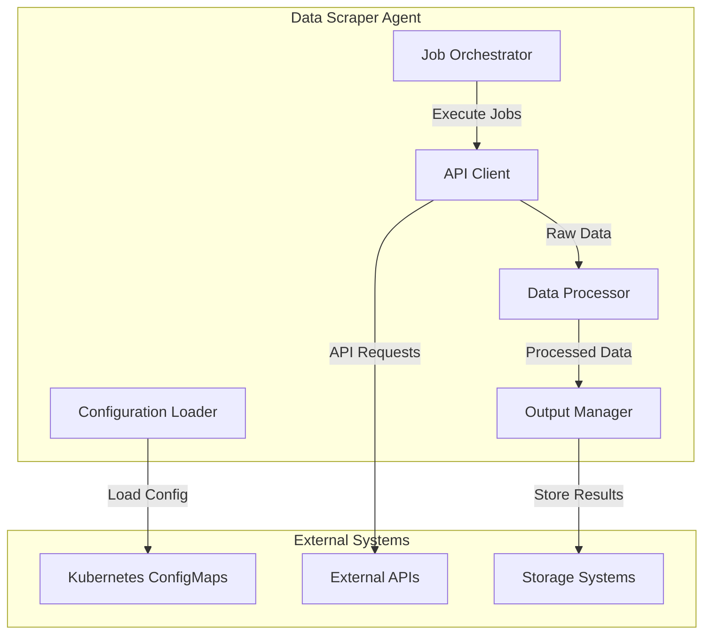

# Data Scraper Agent - Architecture Simplification

## Overview

This document outlines the simplified architecture approach for the Data Scraper Agent, focusing on reducing complexity while maintaining functionality and scalability. The goal is to create a more maintainable and easier-to-deploy system.

## Simplified Architecture Goals

### 1. Reduce Complexity
- **Minimal Dependencies**: Reduce external dependencies and complexity
- **Simple Configuration**: Streamlined configuration management
- **Clear Separation**: Well-defined component boundaries
- **Easy Deployment**: Simplified deployment process

### 2. Improve Maintainability
- **Single Responsibility**: Each component has a clear, focused purpose
- **Testability**: Easy to test individual components
- **Debugging**: Clear error messages and logging
- **Documentation**: Comprehensive and up-to-date documentation

### 3. Enhance Reliability
- **Error Handling**: Robust error handling and recovery
- **Monitoring**: Simple but effective monitoring
- **Backup**: Reliable backup and recovery procedures
- **Security**: Security-first design approach

## Simplified Component Architecture

### Core Components



### Component Responsibilities

#### 1. Configuration Loader
- **Purpose**: Load and validate YAML configurations
- **Input**: ConfigMap files
- **Output**: Validated configuration objects
- **Dependencies**: Pydantic for validation

#### 2. API Client
- **Purpose**: Make HTTP requests to external APIs
- **Input**: API configuration and credentials
- **Output**: Raw API responses
- **Dependencies**: aiohttp for HTTP requests

#### 3. Data Processor
- **Purpose**: Transform and validate data
- **Input**: Raw API responses
- **Output**: Processed data
- **Dependencies**: Built-in transformation logic

#### 4. Output Manager
- **Purpose**: Write data to storage
- **Input**: Processed data
- **Output**: Files in storage
- **Dependencies**: Standard file I/O

#### 5. Job Orchestrator
- **Purpose**: Coordinate the scraping workflow
- **Input**: Job configuration
- **Output**: Execution results
- **Dependencies**: Other components

## Simplified Data Flow

### 1. Configuration Loading
```
ConfigMap → Configuration Loader → Validated Config
```

### 2. Job Execution
```
Job Config → Orchestrator → API Client → External API
```

### 3. Data Processing
```
API Response → Data Processor → Transformed Data
```

### 4. Output Generation
```
Transformed Data → Output Manager → Storage
```

## Configuration Simplification

### Minimal Configuration Schema

```yaml
# Simplified API configuration
name: "API Name"
base_url: "https://api.example.com"
authentication:
  type: "bearer_token"
  token: "$API_TOKEN"
endpoints:
  - name: "data_endpoint"
    url: "/api/data"
    method: "GET"
rate_limit:
  requests_per_minute: 60
output:
  format: "json"
  filename: "data_output"
```

### Environment Variable Management

```bash
# Simple environment variable setup
export API_TOKEN="your_token"
export OUTPUT_PATH="/app/output"
export CONFIG_PATH="/app/config"
```

## Deployment Simplification

### Single Container Deployment

```yaml
apiVersion: apps/v1
kind: Deployment
metadata:
  name: data-scraper
spec:
  replicas: 1
  selector:
    matchLabels:
      app: data-scraper
  template:
    metadata:
      labels:
        app: data-scraper
    spec:
      containers:
      - name: data-scraper
        image: data-scraper:latest
        env:
        - name: API_TOKEN
          valueFrom:
            secretKeyRef:
              name: api-credentials
              key: api-token
        volumeMounts:
        - name: config
          mountPath: /app/config
        - name: output
          mountPath: /app/output
      volumes:
      - name: config
        configMap:
          name: api-configs
      - name: output
        persistentVolumeClaim:
          claimName: data-scraper-output
```

### Minimal Kubernetes Resources

1. **Deployment**: Single deployment for the agent
2. **ConfigMap**: API configurations
3. **Secret**: API credentials
4. **PersistentVolumeClaim**: Data storage
5. **Service**: Internal service (optional)

## Error Handling Simplification

### Centralized Error Handling

```python
class DataScraperError(Exception):
    """Base exception for data scraper errors."""
    pass

class ConfigurationError(DataScraperError):
    """Configuration-related errors."""
    pass

class APIError(DataScraperError):
    """API-related errors."""
    pass

class ProcessingError(DataScraperError):
    """Data processing errors."""
    pass
```

### Simple Error Recovery

1. **Configuration Errors**: Fail fast with clear error messages
2. **API Errors**: Retry with exponential backoff
3. **Processing Errors**: Log error and continue with next record
4. **System Errors**: Graceful shutdown with cleanup

## Monitoring Simplification

### Basic Metrics

```python
# Simple metrics collection
class Metrics:
    def __init__(self):
        self.requests_made = 0
        self.requests_failed = 0
        self.records_processed = 0
        self.execution_time = 0
    
    def to_dict(self):
        return {
            "requests_made": self.requests_made,
            "requests_failed": self.requests_failed,
            "records_processed": self.records_processed,
            "execution_time": self.execution_time,
            "success_rate": self.requests_made / (self.requests_made + self.requests_failed) if (self.requests_made + self.requests_failed) > 0 else 0
        }
```

### Simple Logging

```python
import logging

# Configure simple logging
logging.basicConfig(
    level=logging.INFO,
    format='%(asctime)s - %(name)s - %(levelname)s - %(message)s'
)

logger = logging.getLogger(__name__)
```

## Testing Simplification

### Unit Test Structure

```
tests/
├── unit/
│   ├── test_config_loader.py
│   ├── test_api_client.py
│   ├── test_data_processor.py
│   └── test_output_manager.py
├── integration/
│   └── test_end_to_end.py
└── conftest.py
```

### Simple Test Fixtures

```python
import pytest
from pathlib import Path

@pytest.fixture
def temp_config_dir(tmp_path):
    """Create temporary configuration directory."""
    config_dir = tmp_path / "config"
    config_dir.mkdir()
    return config_dir

@pytest.fixture
def sample_api_config():
    """Sample API configuration for testing."""
    return {
        "name": "Test API",
        "base_url": "https://httpbin.org",
        "authentication": {"type": "none"},
        "endpoints": [{"name": "test", "url": "/json", "method": "GET"}],
        "output": {"format": "json", "filename": "test"}
    }
```

## Security Simplification

### Minimal Security Model

1. **Authentication**: Environment variables for credentials
2. **Authorization**: Kubernetes RBAC for access control
3. **Data Protection**: No sensitive data in logs or output
4. **Network Security**: Network policies for pod communication

### Simple Security Configuration

```yaml
# Network policy for data scraper
apiVersion: networking.k8s.io/v1
kind: NetworkPolicy
metadata:
  name: data-scraper-network-policy
spec:
  podSelector:
    matchLabels:
      app: data-scraper
  policyTypes:
  - Egress
  egress:
  - to: []
    ports:
    - protocol: TCP
      port: 443
```

## Performance Simplification

### Resource Limits

```yaml
resources:
  requests:
    memory: "256Mi"
    cpu: "250m"
  limits:
    memory: "512Mi"
    cpu: "500m"
```

### Simple Caching

```python
class SimpleCache:
    def __init__(self, max_size=1000):
        self.cache = {}
        self.max_size = max_size
    
    def get(self, key):
        return self.cache.get(key)
    
    def set(self, key, value):
        if len(self.cache) >= self.max_size:
            # Remove oldest entry
            oldest_key = next(iter(self.cache))
            del self.cache[oldest_key]
        self.cache[key] = value
```

## Maintenance Simplification

### Simple Backup Strategy

```bash
#!/bin/bash
# Simple backup script

# Backup configurations
kubectl get configmap api-configs -n data-scraper -o yaml > backup/configmap-$(date +%Y%m%d).yaml

# Backup secrets
kubectl get secret api-credentials -n data-scraper -o yaml > backup/secret-$(date +%Y%m%d).yaml

# Backup output data
kubectl exec deployment/data-scraper -n data-scraper -- tar czf /tmp/backup-$(date +%Y%m%d).tar.gz /app/output
kubectl cp data-scraper/data-scraper-xxx:/tmp/backup-$(date +%Y%m%d).tar.gz ./backup/
```

### Simple Health Checks

```python
def health_check():
    """Simple health check function."""
    try:
        # Check configuration loading
        config_loader = ConfigurationLoader("/app/config")
        configs = config_loader.list_configurations()
        
        # Check output directory
        output_path = Path("/app/output")
        if not output_path.exists():
            output_path.mkdir(parents=True, exist_ok=True)
        
        return {"status": "healthy", "configs": len(configs)}
    except Exception as e:
        return {"status": "unhealthy", "error": str(e)}
```

## Benefits of Simplified Architecture

### 1. Reduced Complexity
- **Fewer Components**: Less moving parts to maintain
- **Clear Interfaces**: Well-defined component boundaries
- **Simple Configuration**: Easy to understand and modify
- **Minimal Dependencies**: Fewer external dependencies

### 2. Improved Reliability
- **Fail Fast**: Quick detection and reporting of issues
- **Graceful Degradation**: Continue operation despite partial failures
- **Clear Error Messages**: Easy to understand and debug issues
- **Robust Error Handling**: Comprehensive error recovery

### 3. Enhanced Maintainability
- **Single Responsibility**: Each component has a focused purpose
- **Easy Testing**: Simple to test individual components
- **Clear Documentation**: Comprehensive and up-to-date docs
- **Simple Deployment**: Easy to deploy and update

### 4. Better Performance
- **Optimized Resource Usage**: Efficient use of system resources
- **Simple Caching**: Basic caching for improved performance
- **Minimal Overhead**: Low system overhead
- **Fast Startup**: Quick application startup time

## Migration Path

### Phase 1: Simplify Configuration
1. Reduce configuration complexity
2. Standardize configuration format
3. Implement configuration validation
4. Add configuration documentation

### Phase 2: Streamline Components
1. Simplify component interfaces
2. Reduce component dependencies
3. Implement error handling
4. Add component testing

### Phase 3: Optimize Deployment
1. Simplify Kubernetes resources
2. Implement health checks
3. Add monitoring
4. Create deployment documentation

### Phase 4: Enhance Operations
1. Implement backup procedures
2. Add maintenance scripts
3. Create troubleshooting guides
4. Establish support procedures

## Conclusion

The simplified architecture approach for the Data Scraper Agent focuses on reducing complexity while maintaining functionality and scalability. By simplifying the component design, configuration management, and deployment process, we create a more maintainable and reliable system.

Key benefits include:

1. **Reduced Complexity**: Fewer components and dependencies
2. **Improved Reliability**: Better error handling and recovery
3. **Enhanced Maintainability**: Easier to understand and modify
4. **Better Performance**: Optimized resource usage and faster operation

The simplified architecture provides a solid foundation for future enhancements while maintaining the core functionality and reliability of the system.


