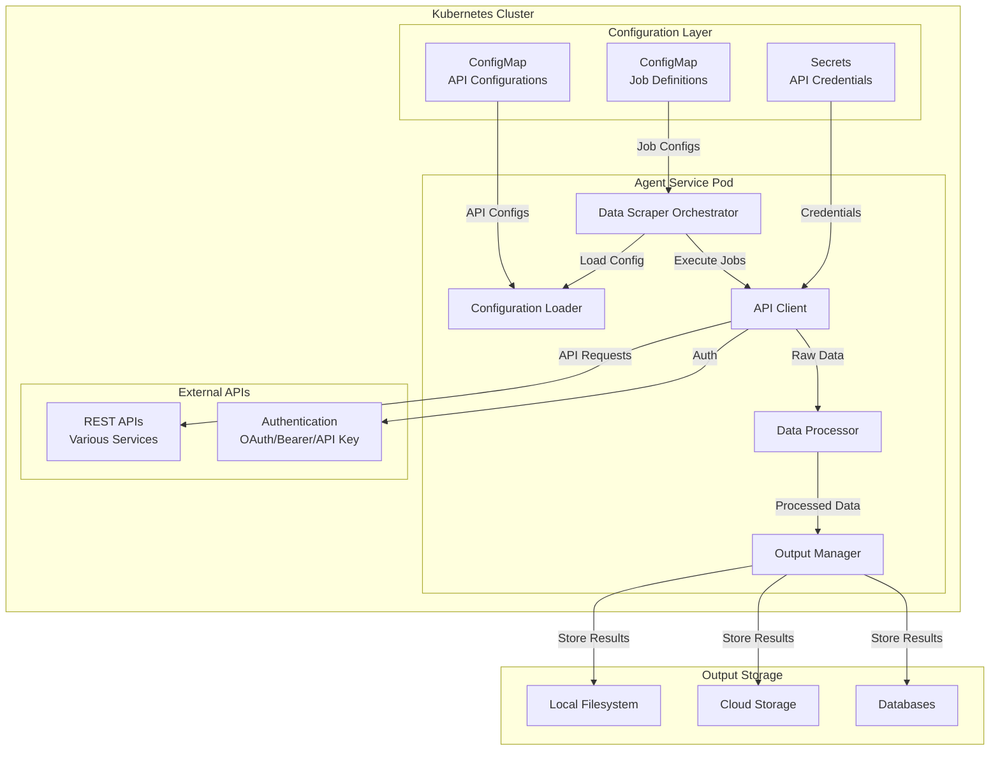
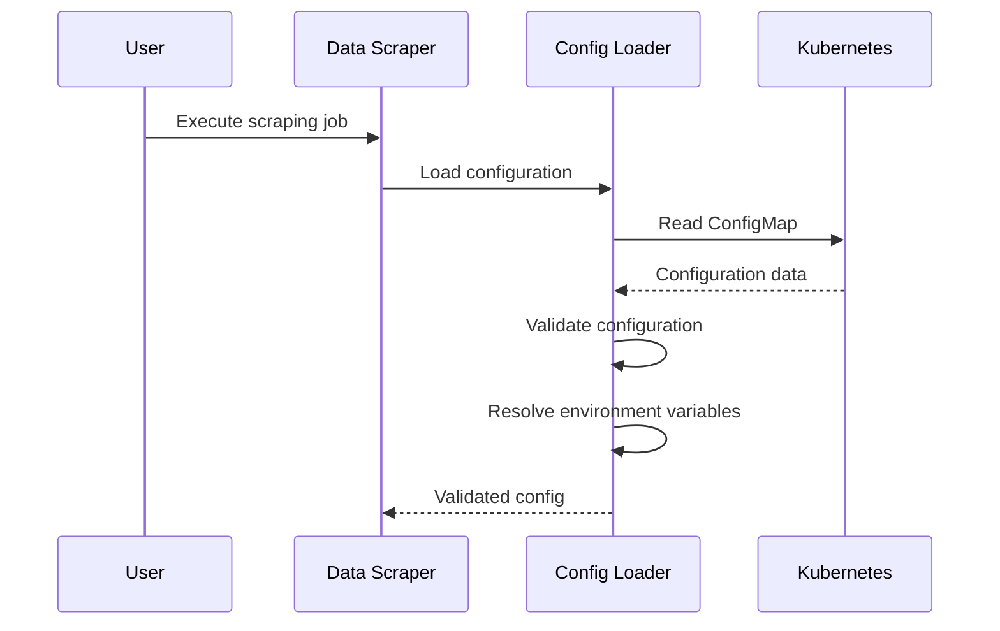
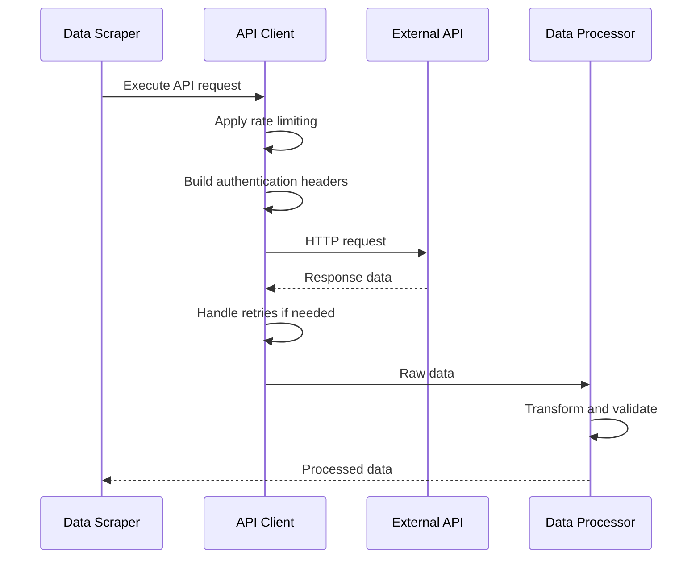

# Data Scraper Agent - Architecture Document

## Overview

The Data Scraper Agent is a configurable, Kubernetes-deployed system that performs automated data extraction from APIs using YAML-based configurations and environment variable authentication. The system provides a robust, scalable solution for API data scraping with built-in rate limiting, retry logic, and data transformation capabilities.

## System Architecture

### High-Level Architecture



### Component Architecture

#### Data Scraper Orchestrator

- **Purpose**: Main coordination component that manages the scraping workflow
- **Responsibilities**:
  - Load API configurations from ConfigMaps
  - Coordinate between all system components
  - Manage execution state and error handling
  - Orchestrate the complete scraping pipeline
  - Handle job scheduling and execution

#### Configuration Loader

- **Purpose**: Manages YAML-based API configurations and validation
- **Responsibilities**:
  - Parse and validate YAML configuration files
  - Resolve environment variables for authentication
  - Validate configuration schemas
  - Support multiple configuration formats
  - Handle configuration hot-reloading

#### API Client

- **Purpose**: Handles HTTP requests to external APIs with advanced features
- **Responsibilities**:
  - Execute HTTP requests with proper authentication
  - Implement rate limiting and retry logic
  - Handle various authentication methods (Bearer, API Key, Basic Auth)
  - Manage request timeouts and error handling
  - Support multiple HTTP methods and content types

#### Data Processor

- **Purpose**: Transforms and validates scraped data
- **Responsibilities**:
  - Apply field mapping and transformations
  - Validate data against defined schemas
  - Filter and clean data according to rules
  - Handle different data formats (JSON, XML, CSV)
  - Generate data quality reports

#### Output Manager

- **Purpose**: Manages data output and storage
- **Responsibilities**:
  - Write data to various output formats (JSON, CSV)
  - Handle file naming and organization
  - Support multiple storage backends
  - Generate execution reports and metadata
  - Manage output retention and cleanup

## Data Flow

### 1. Configuration Loading



### 2. API Request Execution



### 3. Data Processing Pipeline


## Configuration Schema

### API Configuration Structure

```yaml
name: "API Name"
description: "API Description"
base_url: "https://api.example.com"
authentication:
  type: "bearer_token"  # bearer_token, api_key, basic_auth, none
  bearer_token: "$API_TOKEN"
  api_key_name: "X-API-Key"
  api_key_value: "$API_KEY"
  username: "$API_USERNAME"
  password: "$API_PASSWORD"
endpoints:
  - name: "endpoint_name"
    url: "/api/endpoint"
    method: "GET"
    headers:
      Accept: "application/json"
    params:
      limit: 100
    timeout: 30
    retry_attempts: 3
rate_limit:
  requests_per_minute: 60
  requests_per_hour: 1000
  delay_between_requests: 1.0
data_format: "json"  # json, xml, csv
transformation:
  field_mapping:
    id: "user_id"
    name: "user_name"
  field_filters:
    user_name:
      type: "string"
      lowercase: true
      strip: true
  data_validation:
    user_id:
      required: true
      type: "number"
      min: 1
output_config:
  format: "json"  # json, csv
  filename: "output_data"
enabled: true
schedule: "0 */6 * * *"  # Optional cron schedule
```

## Security Considerations

### Authentication Management

- **Environment Variables**: All credentials stored as environment variables
- **Kubernetes Secrets**: Sensitive data managed through K8s secrets
- **No Hardcoded Credentials**: Zero hardcoded authentication data
- **Credential Rotation**: Support for dynamic credential updates

### Rate Limiting

- **Per-API Limits**: Configurable rate limits per API
- **Global Limits**: System-wide rate limiting
- **Exponential Backoff**: Intelligent retry logic
- **Respect API Limits**: Built-in respect for API provider limits

### Data Security

- **Data Validation**: Input validation and sanitization
- **Output Sanitization**: Clean output data
- **Access Control**: Kubernetes RBAC integration
- **Audit Logging**: Comprehensive request logging

## Scalability Features

### Horizontal Scaling

- **Stateless Design**: Agent pods can be scaled horizontally
- **Load Balancing**: Kubernetes service load balancing
- **Resource Limits**: Configurable CPU and memory limits
- **Auto-scaling**: HPA support for dynamic scaling

### Performance Optimization

- **Async Processing**: Non-blocking I/O operations
- **Connection Pooling**: Efficient HTTP connection management
- **Caching**: Intelligent response caching
- **Batch Processing**: Support for bulk data operations

## Monitoring and Observability

### Metrics

- **Request Metrics**: API request counts and response times
- **Error Rates**: Failed request tracking
- **Data Volume**: Processed data volume metrics
- **Rate Limit Usage**: Rate limit utilization tracking

### Logging

- **Structured Logging**: JSON-formatted log output
- **Request Tracing**: End-to-end request tracing
- **Error Context**: Detailed error information
- **Performance Logging**: Execution time and resource usage

### Health Checks

- **Liveness Probes**: Pod health monitoring
- **Readiness Probes**: Service readiness checks
- **Configuration Validation**: Config validation status
- **API Connectivity**: External API connectivity checks

## Integration Points

### Input Sources

- **Kubernetes ConfigMaps**: Configuration management
- **Environment Variables**: Runtime configuration
- **External APIs**: Data sources
- **Webhooks**: Event-driven triggers

### Output Destinations

- **Local Filesystem**: File-based output
- **Cloud Storage**: S3, GCS, Azure Blob
- **Databases**: PostgreSQL, MongoDB, etc.
- **Message Queues**: Kafka, RabbitMQ
- **Webhooks**: Event notifications

## Error Handling

### Retry Logic

- **Exponential Backoff**: Intelligent retry timing
- **Max Retries**: Configurable retry limits
- **Circuit Breaker**: Prevent cascading failures
- **Graceful Degradation**: Partial failure handling

### Error Recovery

- **Checkpointing**: Resume from failure points
- **Data Validation**: Prevent invalid data propagation
- **Alerting**: Error notification systems
- **Manual Intervention**: Support for manual recovery

## Future Architecture Considerations

### Planned Enhancements

- **Plugin System**: Extensible architecture for custom processors
- **Real-time Processing**: Stream processing capabilities
- **Machine Learning**: AI-powered data transformation
- **Multi-tenant Support**: Isolated tenant environments
- **API Gateway**: Centralized API management
- **Service Mesh**: Advanced networking and security


