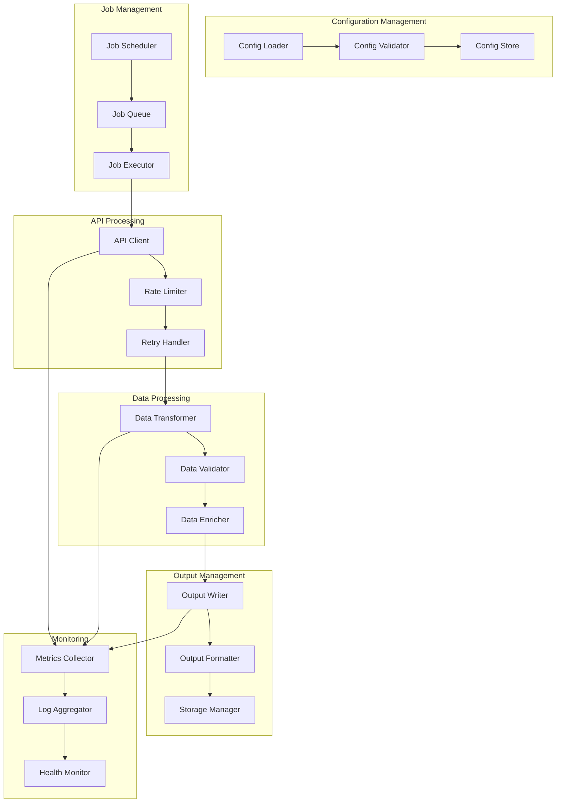
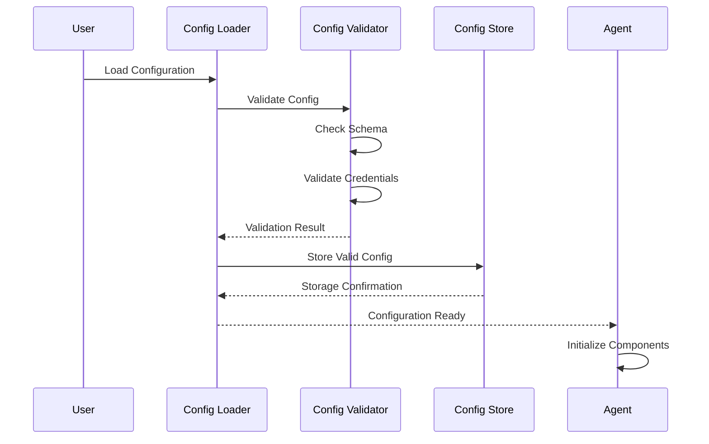
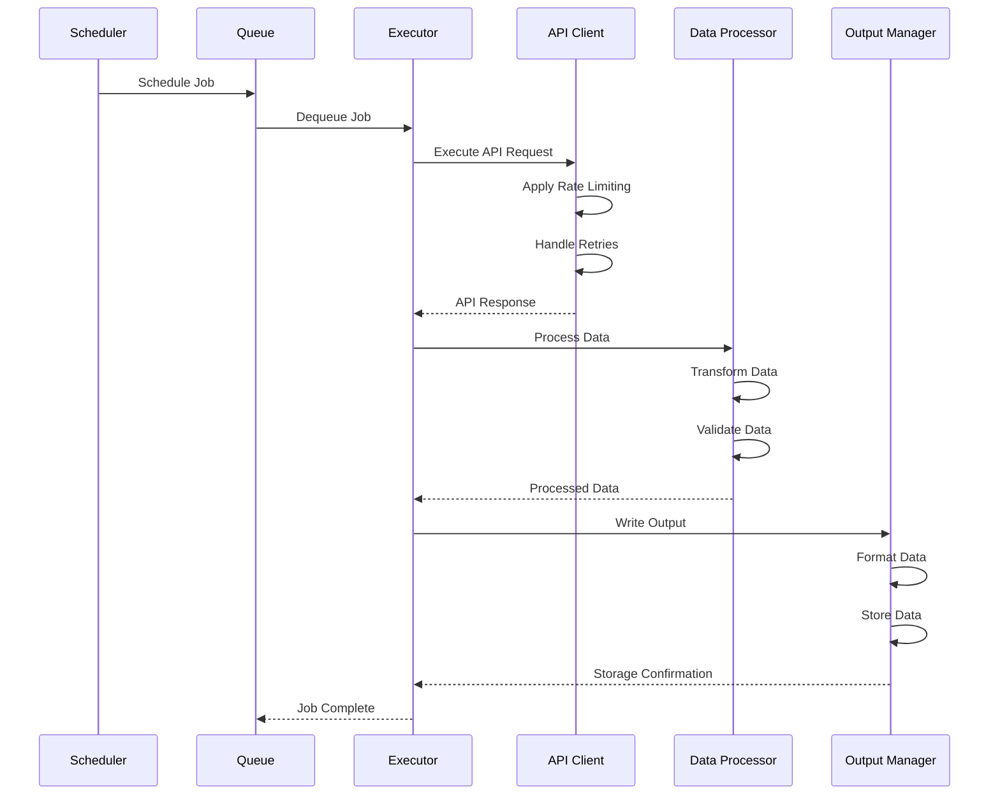
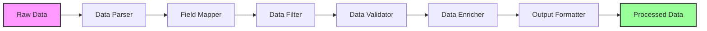

# Data Scraper Agent - Separated Workflow

## Overview

This document outlines the separated workflow approach for the Data Scraper Agent, where different
components operate independently and communicate through well-defined interfaces.
This approach provides better scalability, maintainability, and fault tolerance.

## Workflow Separation Principles

### 1. Component Independence

- **Loose Coupling**: Components communicate through well-defined interfaces
- **Single Responsibility**: Each component has a focused, specific purpose
- **Independent Scaling**: Components can be scaled independently
- **Fault Isolation**: Failures in one component don't affect others

### 2. Data Flow Separation

- **Clear Boundaries**: Well-defined data flow between components
- **Immutable Data**: Data passed between components is immutable
- **Validation**: Data validation at component boundaries
- **Error Handling**: Proper error handling at each step

### 3. Configuration Management
- **Centralized Configuration**: Single source of truth for configuration
- **Environment-Specific**: Different configurations for different environments
- **Hot Reloading**: Configuration changes without restart
- **Validation**: Configuration validation at load time

## Separated Workflow Architecture

### High-Level Workflow



### Component Workflows

#### 1. Configuration Management Workflow



#### 2. Job Execution Workflow



#### 3. Data Processing Workflow



## Component Interfaces

### 1. Configuration Interface

```python
class ConfigurationInterface:
    """Interface for configuration management."""
    
    def load_config(self, config_name: str) -> ApiScrapingConfig:
        """Load configuration by name."""
        pass
    
    def validate_config(self, config: ApiScrapingConfig) -> bool:
        """Validate configuration."""
        pass
    
    def list_configs(self) -> List[str]:
        """List available configurations."""
        pass
    
    def update_config(self, config_name: str, config: ApiScrapingConfig) -> bool:
        """Update configuration."""
        pass
```

### 2. Job Interface

```python
class JobInterface:
    """Interface for job management."""
    
    def create_job(self, config_name: str, params: Dict[str, Any]) -> str:
        """Create a new job."""
        pass
    
    def execute_job(self, job_id: str) -> JobResult:
        """Execute a job."""
        pass
    
    def get_job_status(self, job_id: str) -> JobStatus:
        """Get job status."""
        pass
    
    def cancel_job(self, job_id: str) -> bool:
        """Cancel a job."""
        pass
```

### 3. API Interface

```python
class APIInterface:
    """Interface for API operations."""
    
    def make_request(self, endpoint: ApiEndpoint, auth: Authentication) -> APIResponse:
        """Make API request."""
        pass
    
    def check_rate_limit(self, api_name: str) -> bool:
        """Check rate limit."""
        pass
    
    def handle_retry(self, request_func: Callable, max_retries: int) -> APIResponse:
        """Handle retry logic."""
        pass
```

### 4. Data Processing Interface

```python
class DataProcessingInterface:
    """Interface for data processing."""
    
    def transform_data(self, data: Any, transformation: DataTransformation) -> Any:
        """Transform data."""
        pass
    
    def validate_data(self, data: Any, validation_rules: Dict[str, Any]) -> bool:
        """Validate data."""
        pass
    
    def enrich_data(self, data: Any, enrichment_rules: Dict[str, Any]) -> Any:
        """Enrich data."""
        pass
```

### 5. Output Interface

```python
class OutputInterface:
    """Interface for output management."""
    
    def write_data(self, data: Any, output_config: OutputConfig) -> bool:
        """Write data to output."""
        pass
    
    def format_data(self, data: Any, format_type: str) -> str:
        """Format data for output."""
        pass
    
    def store_data(self, data: str, storage_config: StorageConfig) -> bool:
        """Store data in storage system."""
        pass
```

## Workflow Orchestration

### 1. Main Orchestrator

```python
class WorkflowOrchestrator:
    """Main workflow orchestrator."""
    
    def __init__(self):
        self.config_manager = ConfigurationManager()
        self.job_manager = JobManager()
        self.api_manager = APIManager()
        self.data_processor = DataProcessor()
        self.output_manager = OutputManager()
        self.monitor = Monitor()
    
    async def execute_workflow(self, config_name: str, params: Dict[str, Any]) -> WorkflowResult:
        """Execute complete workflow."""
        try:
            # Step 1: Load and validate configuration
            config = await self.config_manager.load_config(config_name)
            if not await self.config_manager.validate_config(config):
                raise ConfigurationError(f"Invalid configuration: {config_name}")
            
            # Step 2: Create and execute job
            job_id = await self.job_manager.create_job(config_name, params)
            job_result = await self.job_manager.execute_job(job_id)
            
            # Step 3: Process API requests
            api_responses = []
            for endpoint in config.endpoints:
                response = await self.api_manager.make_request(endpoint, config.authentication)
                api_responses.append(response)
            
            # Step 4: Process data
            processed_data = []
            for response in api_responses:
                data = await self.data_processor.transform_data(response.data, config.transformation)
                if await self.data_processor.validate_data(data, config.transformation.data_validation):
                    processed_data.append(data)
            
            # Step 5: Write output
            output_result = await self.output_manager.write_data(processed_data, config.output_config)
            
            # Step 6: Update monitoring
            await self.monitor.record_workflow_completion(job_id, len(processed_data))
            
            return WorkflowResult(
                job_id=job_id,
                status="completed",
                records_processed=len(processed_data),
                output_location=output_result.location
            )
            
        except Exception as e:
            await self.monitor.record_workflow_error(job_id, str(e))
            raise WorkflowError(f"Workflow execution failed: {e}")
```

### 2. Component Communication

```python
class ComponentCommunication:
    """Handles communication between components."""
    
    def __init__(self):
        self.event_bus = EventBus()
        self.message_queue = MessageQueue()
    
    async def send_event(self, event_type: str, data: Any):
        """Send event to event bus."""
        await self.event_bus.publish(event_type, data)
    
    async def send_message(self, component: str, message: Any):
        """Send message to component."""
        await self.message_queue.send(component, message)
    
    async def receive_message(self, component: str) -> Any:
        """Receive message for component."""
        return await self.message_queue.receive(component)
```

## Error Handling and Recovery

### 1. Error Propagation

```python
class ErrorHandler:
    """Handles errors in workflow components."""
    
    def __init__(self):
        self.error_logger = ErrorLogger()
        self.retry_manager = RetryManager()
    
    async def handle_error(self, error: Exception, context: str) -> ErrorResult:
        """Handle error with context."""
        # Log error
        await self.error_logger.log_error(error, context)
        
        # Determine recovery strategy
        recovery_strategy = self.determine_recovery_strategy(error, context)
        
        # Execute recovery
        if recovery_strategy == "retry":
            return await self.retry_manager.retry_operation(context)
        elif recovery_strategy == "skip":
            return ErrorResult(status="skipped", error=str(error))
        elif recovery_strategy == "fail":
            return ErrorResult(status="failed", error=str(error))
    
    def determine_recovery_strategy(self, error: Exception, context: str) -> str:
        """Determine recovery strategy based on error and context."""
        if isinstance(error, RateLimitError):
            return "retry"
        elif isinstance(error, ConfigurationError):
            return "fail"
        elif isinstance(error, DataValidationError):
            return "skip"
        else:
            return "retry"
```

### 2. Circuit Breaker Pattern

```python
class CircuitBreaker:
    """Implements circuit breaker pattern for fault tolerance."""
    
    def __init__(self, failure_threshold: int = 5, timeout: int = 60):
        self.failure_threshold = failure_threshold
        self.timeout = timeout
        self.failure_count = 0
        self.last_failure_time = None
        self.state = "closed"  # closed, open, half-open
    
    async def call(self, func: Callable, *args, **kwargs):
        """Execute function with circuit breaker protection."""
        if self.state == "open":
            if time.time() - self.last_failure_time > self.timeout:
                self.state = "half-open"
            else:
                raise CircuitBreakerError("Circuit breaker is open")
        
        try:
            result = await func(*args, **kwargs)
            if self.state == "half-open":
                self.state = "closed"
                self.failure_count = 0
            return result
        except Exception as e:
            self.failure_count += 1
            self.last_failure_time = time.time()
            
            if self.failure_count >= self.failure_threshold:
                self.state = "open"
            
            raise e
```

## Monitoring and Observability

### 1. Metrics Collection

```python
class MetricsCollector:
    """Collects metrics from workflow components."""
    
    def __init__(self):
        self.metrics_store = MetricsStore()
    
    async def record_metric(self, metric_name: str, value: float, tags: Dict[str, str]):
        """Record a metric."""
        await self.metrics_store.store(metric_name, value, tags)
    
    async def record_workflow_metric(self, workflow_id: str, metric_type: str, value: float):
        """Record workflow-specific metric."""
        tags = {"workflow_id": workflow_id, "metric_type": metric_type}
        await self.record_metric("workflow_metrics", value, tags)
    
    async def record_component_metric(self, component: str, metric_type: str, value: float):
        """Record component-specific metric."""
        tags = {"component": component, "metric_type": metric_type}
        await self.record_metric("component_metrics", value, tags)
```

### 2. Health Monitoring

```python
class HealthMonitor:
    """Monitors health of workflow components."""
    
    def __init__(self):
        self.health_checks = {}
        self.alert_manager = AlertManager()
    
    def register_health_check(self, component: str, check_func: Callable):
        """Register health check for component."""
        self.health_checks[component] = check_func
    
    async def check_health(self) -> Dict[str, HealthStatus]:
        """Check health of all components."""
        health_status = {}
        
        for component, check_func in self.health_checks.items():
            try:
                status = await check_func()
                health_status[component] = status
                
                if status.status == "unhealthy":
                    await self.alert_manager.send_alert(f"Component {component} is unhealthy: {status.message}")
            except Exception as e:
                health_status[component] = HealthStatus(status="error", message=str(e))
                await self.alert_manager.send_alert(f"Health check failed for {component}: {e}")
        
        return health_status
```

## Benefits of Separated Workflow

### 1. Scalability
- **Independent Scaling**: Each component can be scaled independently
- **Load Distribution**: Workload can be distributed across multiple instances
- **Resource Optimization**: Resources can be allocated based on component needs
- **Horizontal Scaling**: Easy to add more instances of components

### 2. Maintainability
- **Modular Design**: Each component can be developed and maintained independently
- **Clear Interfaces**: Well-defined interfaces make integration easier
- **Testing**: Components can be tested in isolation
- **Debugging**: Issues can be isolated to specific components

### 3. Fault Tolerance
- **Fault Isolation**: Failures in one component don't affect others
- **Graceful Degradation**: System can continue operating with reduced functionality
- **Error Recovery**: Components can recover from errors independently
- **Circuit Breakers**: Prevent cascading failures

### 4. Flexibility
- **Component Replacement**: Components can be replaced without affecting others
- **Technology Diversity**: Different components can use different technologies
- **Configuration Changes**: Components can be reconfigured independently
- **Feature Addition**: New features can be added as separate components

## Implementation Considerations

### 1. Message Queues
- **Reliability**: Ensure message delivery and processing
- **Ordering**: Maintain message order when required
- **Persistence**: Persist messages for fault tolerance
- **Monitoring**: Monitor queue health and performance

### 2. Event Sourcing
- **Event Store**: Store all events for audit and replay
- **Event Versioning**: Handle event schema evolution
- **Event Replay**: Replay events for debugging and recovery
- **Event Projections**: Build read models from events

### 3. CQRS (Command Query Responsibility Segregation)
- **Command Side**: Handle write operations
- **Query Side**: Handle read operations
- **Event Sourcing**: Use events for state changes
- **Read Models**: Optimize read models for queries

### 4. Saga Pattern
- **Distributed Transactions**: Handle transactions across components
- **Compensation**: Implement compensation for failed operations
- **Orchestration**: Coordinate distributed transactions
- **Monitoring**: Monitor saga execution and recovery

## Conclusion

The separated workflow approach for the Data Scraper Agent provides a robust, scalable, and maintainable architecture. By separating concerns and creating well-defined interfaces between components, we achieve better fault tolerance, easier testing, and improved scalability.

Key benefits include:

1. **Scalability**: Independent scaling of components
2. **Maintainability**: Modular design with clear interfaces
3. **Fault Tolerance**: Fault isolation and graceful degradation
4. **Flexibility**: Easy component replacement and feature addition

The separated workflow provides a solid foundation for building a production-ready data scraping system that can handle complex requirements and scale with business needs.


