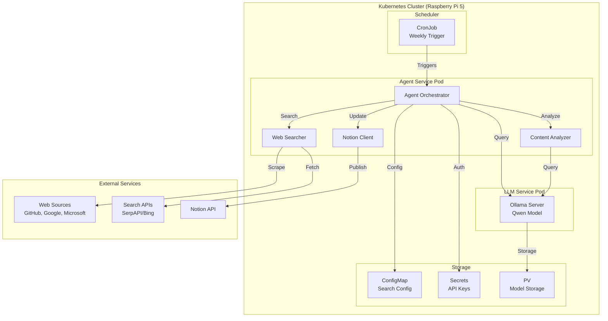

# LLM Release Radar Agent - Architecture Document

## Overview

The LLM Release Radar Agent is a Kubernetes-deployed system running on Raspberry Pi 5 that automatically monitors and reports on the latest LLM releases, features, and announcements from major tech companies.

## System Architecture



## Data Flow

### 1. Weekly Execution Trigger
- **Input**: CronJob schedule (weekly)
- **Process**: Kubernetes CronJob triggers Agent Orchestrator
- **Output**: Agent execution initiated

### 2. Information Gathering Phase
```
Agent Orchestrator → Web Searcher → External Sources
                  ↓
              Search Results (Raw HTML/JSON)
```

**Sources Monitored:**
- **LLM Releases**: Hugging Face, OpenAI Blog, Anthropic, Meta AI
- **GitHub**: AI/ML repositories, GitHub Blog, release pages
- **Google**: AI Blog, Research publications, Developer updates
- **Microsoft**: Azure AI updates, Research blog, GitHub releases

### 3. Content Analysis Phase
```
Raw Content → Content Analyzer → Local Qwen LLM → Structured Analysis
```

**Analysis Tasks:**
- Extract key information about new LLM releases
- Identify new features and capabilities
- Categorize announcements by company and impact
- Generate summaries and key takeaways
- Extract relevant links and sources

### 4. Content Structuring
```
LLM Analysis → Data Structurer → Notion-Ready Format
```

**Output Structure:**
```json
{
  "week_of": "2024-01-15",
  "major_releases": [
    {
      "company": "OpenAI",
      "product": "GPT-4.5",
      "release_date": "2024-01-12",
      "key_features": ["..."],
      "impact_level": "high",
      "source_links": ["..."]
    }
  ],
  "feature_announcements": [...],
  "research_papers": [...],
  "summary": "This week's highlights..."
}
```

### 5. Notion Publishing Phase
```
Structured Data → Notion Client → Notion API → Notion Page Update
```

## Component Architecture

### Agent Orchestrator (`main.py`)
**Responsibilities:**
- Coordinate all agent activities
- Manage execution flow
- Handle error recovery
- Log activities

**Key Methods:**
```python
async def execute_weekly_scan()
async def coordinate_search()
async def analyze_content()
async def publish_to_notion()
```

### Web Searcher (`web_searcher.py`)
**Responsibilities:**
- Execute web searches via APIs
- Scrape specific company pages
- Handle rate limiting
- Parse RSS feeds

**Search Strategies:**
- **API-based**: SerpAPI, Bing Search API
- **Direct scraping**: Company blogs, GitHub releases
- **RSS feeds**: Blog feeds, release feeds

### Content Analyzer (`content_analyzer.py`)
**Responsibilities:**
- Interface with local Qwen LLM
- Extract structured information
- Categorize and prioritize content
- Generate summaries

**Analysis Prompts:**
- LLM release identification
- Feature extraction
- Impact assessment
- Summary generation

### Notion Client (`notion_client.py`)
**Responsibilities:**
- Authenticate with Notion API
- Create/update database entries
- Format content for Notion
- Handle API rate limits

### LLM Client (`llm_client.py`)
**Responsibilities:**
- Connect to local Ollama server
- Manage prompt templates
- Handle model responses
- Implement retry logic

## Deployment Architecture

### Kubernetes Resources

#### 1. LLM Server Deployment
```yaml
apiVersion: apps/v1
kind: Deployment
metadata:
  name: qwen-llm-server
spec:
  replicas: 1
  template:
    spec:
      containers:
      - name: ollama
        image: ollama/ollama:latest
        resources:
          requests:
            memory: "4Gi"
            cpu: "2"
          limits:
            memory: "6Gi"
            cpu: "4"
```

#### 2. Agent Service Deployment
```yaml
apiVersion: apps/v1
kind: Deployment
metadata:
  name: llm-radar-agent
spec:
  replicas: 1
  template:
    spec:
      containers:
      - name: agent
        image: llm-radar-agent:latest
        env:
        - name: OLLAMA_HOST
          value: "qwen-llm-server:11434"
```

#### 3. Scheduled Execution
```yaml
apiVersion: batch/v1
kind: CronJob
metadata:
  name: weekly-llm-scan
spec:
  schedule: "0 9 * * 1"  # Every Monday at 9 AM
  jobTemplate:
    spec:
      template:
        spec:
          containers:
          - name: agent-trigger
            image: llm-radar-agent:latest
            command: ["python", "main.py"]
```

## Configuration Management

### Environment Variables
- `OLLAMA_HOST`: Local LLM server endpoint
- `NOTION_TOKEN`: Notion integration token
- `NOTION_DATABASE_ID`: Target Notion database
- `SEARCH_API_KEY`: Web search API key
- `LOG_LEVEL`: Logging verbosity

### ConfigMap Structure
```yaml
apiVersion: v1
kind: ConfigMap
metadata:
  name: agent-config
data:
  search_sources.yaml: |
    sources:
      - name: "huggingface"
        url: "https://huggingface.co/blog"
        type: "rss"
      - name: "openai"
        url: "https://openai.com/blog"
        type: "scrape"
```

## Error Handling & Resilience

### Retry Strategies
- **Web requests**: Exponential backoff, max 3 retries
- **LLM queries**: Circuit breaker pattern
- **Notion API**: Rate limit handling with delays

### Monitoring & Logging
- **Health checks**: HTTP endpoints for readiness/liveness
- **Metrics**: Prometheus-compatible metrics
- **Logging**: Structured JSON logs with correlation IDs

## Security Considerations

### API Key Management
- Store sensitive keys in Kubernetes Secrets
- Rotate keys regularly
- Use least-privilege access

### Network Security
- Internal service communication only
- No external access to LLM server
- HTTPS for all external API calls

## Performance Optimization

### Resource Management
- **CPU**: Optimized for Pi 5's ARM architecture
- **Memory**: Efficient model loading and caching
- **Storage**: Persistent volumes for model data

### Caching Strategy
- Cache web search results for 24 hours
- Cache LLM responses for similar queries
- Implement content deduplication

## Scalability Considerations

### Horizontal Scaling
- Agent service can be scaled for parallel processing
- Search operations can be distributed
- LLM server remains single instance due to resource constraints

### Future Enhancements
- Support for multiple LLM models
- Real-time monitoring dashboard
- Integration with additional platforms (Slack, Discord)
- Advanced analytics and trending analysis
