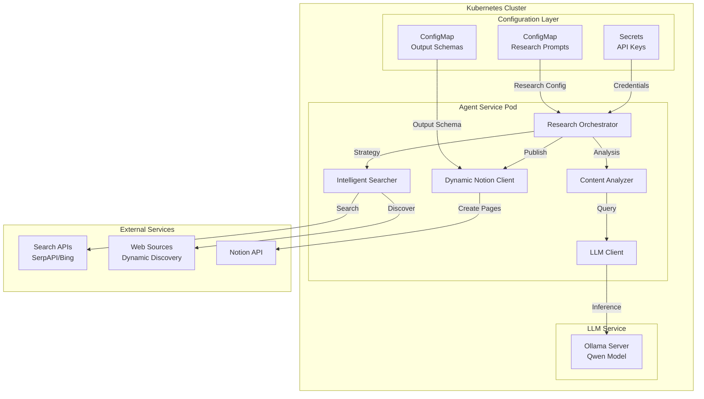

# Research Copilot Agent - Architecture Document

## Overview

The Research Copilot Agent is a configurable, Kubernetes-deployed system that performs intelligent
research on any user-specified topic and generates structured reports in Notion. The system leverages
large language models for intelligent search strategy generation, content analysis, and report synthesis.

## System Architecture

### High-Level Architecture



### Component Architecture

#### Research Orchestrator

- **Purpose**: Main coordination component that manages the research workflow
- **Responsibilities**:
  - Load research configuration from ConfigMaps
  - Coordinate between all system components
  - Manage execution state and error handling
  - Orchestrate the complete research pipeline

#### Intelligent Searcher

- **Purpose**: LLM-powered search strategy generator and executor
- **Responsibilities**:
  - Generate dynamic search strategies based on research topics
  - Discover relevant sources using LLM intelligence
  - Execute multi-phase adaptive search
  - Perform contextual follow-up searches based on initial findings

#### Content Analyzer

- **Purpose**: Processes and analyzes collected content using LLM
- **Responsibilities**:
  - Extract structured information from web content
  - Perform sentiment and relevance analysis
  - Synthesize findings across multiple sources
  - Generate insights and recommendations

#### Dynamic Notion Client

- **Purpose**: Creates Notion pages based on configurable output schemas
- **Responsibilities**:
  - Parse output schema definitions
  - Generate dynamic page structures
  - Create rich content blocks (tables, lists, callouts)
  - Handle various content types and formatting

#### LLM Client

- **Purpose**: Interface to local Qwen model via Ollama
- **Responsibilities**:
  - Generate search strategies and queries
  - Analyze content and extract insights
  - Synthesize research findings
  - Generate structured outputs

## Data Flow

### Research Execution Flow

1. **Configuration Loading**
   - Load research prompt from ConfigMap
   - Parse output schema definition
   - Validate configuration parameters

2. **Strategy Generation**
   - LLM generates comprehensive search strategy
   - Identifies potential sources and query approaches
   - Determines analysis focus areas

3. **Intelligent Search**
   - Execute initial broad search using generated queries
   - Analyze results to identify trends and gaps
   - Generate follow-up queries based on findings
   - Discover new sources dynamically

4. **Content Analysis**
   - Process collected content through LLM
   - Extract structured information and insights
   - Perform relevance and credibility assessment
   - Synthesize findings across sources

5. **Report Generation**
   - Apply output schema to structure findings
   - Generate dynamic Notion page layout
   - Create rich content blocks with proper formatting
   - Publish final research report

### Configuration Management

Research configurations are managed through Kubernetes ConfigMaps with the following structure:

#### Research Prompt Configuration

```yaml
research_request:
  topic:
    name: string
    description: string
    keywords: [string]
    focus_areas: [string]
    time_range: string
    depth: enum(basic|detailed|comprehensive)
  search_strategy:
    max_sources: integer
    source_types: [enum]
    credibility_threshold: float
  analysis_instructions: string
```

#### Output Schema Configuration

```yaml
output_format:
  type: enum(notion_page|markdown|json)
  template: string
page_structure:
  title_template: string
  sections:
    - name: string
      type: enum(text_block|bullet_list|table|toggle_blocks)
      content_source: string
      configuration: object
content_processing:
  summary_length: enum(short|medium|detailed)
  include_confidence_scores: boolean
  group_similar_findings: boolean
```

## Deployment Architecture

### Kubernetes Resources

#### ConfigMaps

- **research-config**: Contains research prompts and parameters
- **output-schema**: Defines output structure and formatting
- **template-library**: Pre-built templates for common research types

#### Secrets

- **api-credentials**: Search API keys and Notion tokens
- **llm-config**: LLM service configuration

#### Deployments

- **research-agent**: Main agent service with horizontal scaling
- **ollama-server**: LLM inference server with GPU support

#### Services

- **research-api**: Internal API for agent communication
- **ollama-service**: LLM service endpoint

### Resource Requirements

#### Research Agent Pod

- **CPU**: 500m requests, 1000m limits
- **Memory**: 1Gi requests, 2Gi limits
- **Storage**: 1Gi for temporary files and caching

#### Ollama Server Pod

- **CPU**: 2000m requests, 4000m limits
- **Memory**: 4Gi requests, 8Gi limits
- **Storage**: 10Gi for model storage

## Security Architecture

### Authentication and Authorization

- Service accounts with minimal required permissions
- RBAC policies for ConfigMap and Secret access
- Network policies for pod-to-pod communication

### Data Protection

- API keys stored in Kubernetes Secrets
- TLS encryption for external API communications
- Secure handling of research content in memory

### Network Security

- Internal service communication over cluster network
- External API access through controlled egress policies
- No direct external access to agent pods

## Scalability and Performance

### Horizontal Scaling

- Research agent pods can scale based on workload
- Load balancing across multiple agent instances
- Queue-based work distribution for concurrent research

### Performance Optimization

- Intelligent caching of search results and analysis
- Batch processing of similar research requests
- Efficient memory management for large content processing

### Resource Management

- Resource quotas and limits per namespace
- Priority classes for critical system components
- Graceful degradation under resource constraints

## Monitoring and Observability

### Metrics Collection

- Research execution times and success rates
- LLM inference performance and token usage
- External API response times and error rates
- Resource utilization across all components

### Logging Strategy

- Structured JSON logging with correlation IDs
- Centralized log aggregation and search
- Different log levels for development and production

### Health Checks

- Readiness and liveness probes for all services
- Dependency health monitoring
- Automated recovery from transient failures

## Error Handling and Resilience

### Retry Strategies

- Exponential backoff for external API calls
- Circuit breaker pattern for failing services
- Graceful degradation when components are unavailable

### Fault Tolerance

- Multiple fallback strategies for search failures
- Partial result handling when some sources fail
- Automatic retry of failed research requests

### Data Consistency

- Idempotent operations for research execution
- Consistent state management across retries
- Proper cleanup of temporary resources

## Integration Points

### External APIs

- **Search APIs**: SerpAPI, Bing Search API for web search
- **Notion API**: Page creation and content management
- **Web Sources**: Direct scraping with rate limiting

### Internal Services

- **LLM Service**: Local Ollama server for inference
- **Configuration Service**: Kubernetes API for ConfigMap access
- **Monitoring Service**: Metrics and health status reporting

## Future Architecture Considerations

### Multi-Model Support

- Support for multiple LLM models and providers
- Model selection based on research requirements
- Fallback mechanisms for model unavailability

### Advanced Analytics

- Research trend analysis across multiple executions
- Source credibility scoring and learning
- Automated research quality assessment

### Enhanced Integration

- Support for additional output formats and destinations
- Integration with collaboration tools beyond Notion
- API endpoints for external system integration
