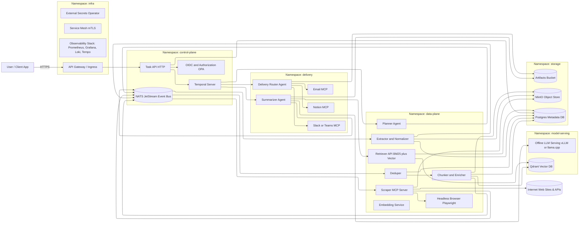

# Multi‑Agent Offline Research Analyst — Component Architecture

Production‑grade architecture for a multi‑agent research analyst that scrapes the web, runs summaries on an **offline LLM**, and delivers results via email/Notion/other apps on Kubernetes. Each component below has a clear separation of concern with API contracts, data models, deployment notes, security, observability, and failure modes.

---

## Table of Contents

1. [API Gateway / Ingress](#api-gateway--ingress)
2. [AuthN/Z](#authnz)
3. [Task API (Control Entry)](#task-api-control-entry)
4. [Workflow Orchestrator (Temporal)](#workflow-orchestrator-temporal)
5. [Event Bus (NATS JetStream)](#event-bus-nats-jetstream)
6. [Planner Agent](#planner-agent)
7. [Scraper MCP Server](#scraper-mcp-server)
8. [Browser Sandbox](#browser-sandbox)
9. [Extractor / Normalizer](#extractor--normalizer)
10. [Deduper](#deduper)
11. [Chunker & Metadata Enricher](#chunker--metadata-enricher)
12. [Object Store (MinIO)](#object-store-minio)
13. [Document Metadata Store (Postgres)](#document-metadata-store-postgres)
14. [Embedding Service (Offline)](#embedding-service-offline)
15. [Vector DB (Qdrant)](#vector-db-qdrant)
16. [Retriever API](#retriever-api)
17. [LLM Serving (Offline)](#llm-serving-offline)
18. [Summarizer Agent](#summarizer-agent)
19. [Artifacts Store (Reports)](#artifacts-store-reports)
20. [Delivery Router Agent](#delivery-router-agent)
21. [Email MCP Server](#email-mcp-server)
22. [Notion MCP Server](#notion-mcp-server)
23. [Slack/Teams MCP Server](#slackteams-mcp-server)
24. [Observability Stack](#observability-stack)
25. [Security & Policy Controls](#security--policy-controls)
26. [Secrets Management](#secrets-management)
27. [CI/CD & Supply Chain](#cicd--supply-chain)
28. [Kubernetes Footprint & Sizing](#kubernetes-footprint--sizing)
29. [Global Data Contracts](#global-data-contracts)
30. [Runbooks & SRE Playbooks](#runbooks--sre-playbooks)

---

## Reference Diagram



---

## API Gateway / Ingress

**Purpose**: North–south entry, routing, TLS termination, rate‑limiting, auth handoff.

**Tech**: NGINX Ingress Controller or Traefik; optional service mesh (Linkerd/Istio) for mTLS east–west.

**Responsibilities**

- Terminate TLS; enforce HSTS.
- Path/host routing to Task API, Temporal Web, Retriever API (optionally internal‑only).
- AuthN delegation (OIDC/JWT); request size limits; IP allow/deny lists.

**K8s**
- Namespace: `infra`.
- Objects: `Ingress`, `ConfigMap` (rate limits), `Service`, `Deployment`.
- Policy: `NetworkPolicy` to fence egress except DNS/OCSP for certs.

**Failure modes** & **Mitigations**
- Misrouted traffic → Canary on Ingress annotations, health checks.
- TLS renewal failures → Cert‑manager with DNS‑01; alerts on cert expiry.

---

## AuthN/Z
**Purpose**: Federated login, service‑to‑service auth, fine‑grained authorization.

**Tech**: OIDC (Azure AD/Entra or Auth0), OPA/Gatekeeper for RBAC/ABAC.

**Responsibilities**
- Issue JWTs for user‑facing flows.
- SPIFFE/SPIRE (optional) for workload identities.

**Interfaces**
- `Authorization: Bearer <jwt>` propagated by Gateway.
- Service accounts with projected tokens; mesh mTLS.

---

## Task API (Control Entry)
**Purpose**: Receives user intent and starts a workflow instance.

**Responsibilities**
- Validate payload `{topic, constraints, output_schema, delivery_targets}`.
- Create Temporal workflow with idempotency key.
- Persist submission metadata to Postgres.

**API (HTTP)**
- `POST /v1/tasks` → `{task_id}`
- `GET /v1/tasks/{task_id}` → status, links to artifacts, delivery receipts.

**Schemas**
```json
{
  "topic": "string",
  "constraints": {"timebox_minutes": 30, "seed_urls": ["https://…"], "depth": 1},
  "output_schema": {"$schema": "https://json-schema.org/draft/2020-12/schema", "...": "..."},
  "delivery_targets": [{"type":"email","to":["a@b.com"]},{"type":"notion","space":"…"}]
}
```

**K8s**: Stateless `Deployment` with HPA; `NetworkPolicy` allow only to Temporal Frontend and Postgres.

---

## Workflow Orchestrator (Temporal)
**Purpose**: Durable workflows, retries, human‑in‑the‑loop, observability.

**Responsibilities**
- Execute workflow: Plan → Scrape → Normalize → Index → Summarize → Deliver.
- Activity retries with exponential backoff; compensation steps.

**Key Workflows / Activities**
- `PlannerActivity`, `SubmitScrapePlan`, `AwaitNormalized`, `IndexChunks`, `Summarize`, `Deliver`.

**K8s**: Use official Helm; dedicated Postgres; Web UI behind SSO.

**Failure modes**
- Stuck workflow → timeouts + alerts; DLQ for activities via NATS side channel.

---

## Event Bus (NATS JetStream)
**Purpose**: Loose coupling, back‑pressure, fan‑out.

**Streams/Subjects**
- `scrape.plan.created`
- `raw.doc.ingested`
- `doc.normalized`
- `chunks.ready`
- `analysis.ready`
- `delivery.requested` / `delivery.acked`

**Contracts**: CloudEvents‑like envelopes (see [Global Data Contracts](#global-data-contracts)).

**K8s**: Single cluster, enabled persistence; KEDA ScaledObjects on consumer lag.

---

## Planner Agent
**Purpose**: Expand user intent into a constrained scraping plan and RAG config.

**Responsibilities**
- Generate `seed_urls`, domain allowlist, rate limits, MIME policy.
- Emit `scrape.plan.created` with budgets.

**Inputs**: Task payload, historical hints, allow/deny lists.

**Outputs**: `ScrapePlan` JSON.

**K8s**: Stateless; horizontal scale; CPU‑bound. Optional cache of per‑domain politeness.

**Observability**: Trace span linking to Task ID; prompt/plan redaction for PII.

---

## Scraper MCP Server
**Purpose**: Tool endpoint that performs HTTP fetch and controlled crawling.

**Responsibilities**
- Respect robots.txt (configurable), per‑domain concurrency & delays.
- Fetch HTML/PDF/Media; Playwright fallback for dynamic content.
- Persist raw to MinIO; emit `raw.doc.ingested`.

**MCP Methods (examples)**
- `scrape.run(task: ScrapePlan) → ScrapeReceipt`
- `scrape.fetch(url: string, headers?: map) → RawBlobRef`

**Security**
- Runs in isolated namespace with egress policies; read‑only FS; seccomp/AppArmor; no root.
- DNS‑based allow/deny policies; user‑agent + contact string.

**Scaling**: KEDA on `scrape.plan.created`.

---

## Browser Sandbox
**Purpose**: Headless rendering for JS‑heavy sites.

**Tech**: Playwright/Chromium in locked‑down container; xvfb not required in headless mode.

**Notes**
- Disable GPU, fonts subset to reduce image size; persistent context **disabled**.
- Harsh timeouts (e.g., 15s) + screenshot on failure (stored in MinIO for debugging).

---

## Extractor / Normalizer
**Purpose**: Convert raw blobs into clean text + metadata.

**Responsibilities**
- Main content extraction (Readability/Goose); HTML → Markdown; PDF → text (Tesseract OCR optional).
- Language detection; date extraction; canonical URL resolution.
- Output `NormalizedDocument` and store Markdown in MinIO.

**API (gRPC/HTTP)**
- `POST /normalize {raw_ref}` → `{doc_id, md_ref, meta}`

**Scaling**: CPU‑bound; KEDA on `raw.doc.ingested`.

---

## Deduper
**Purpose**: Eliminate near‑duplicate docs/chunks.

**Tech**: SimHash/MinHash + URL canonicalization.

**API**
- `POST /dedupe {doc_id, text}` → `{kept:boolean, canonical_id}`

**Notes**: Store fingerprints in Postgres; keep provenance chain.

---

## Chunker & Metadata Enricher
**Purpose**: Split text into chunks with overlap and attach rich metadata.

**Responsibilities**
- Token‑aware splitting; per‑chunk provenance (URL, collected_at, published_at).
- Topic/NER tags; hash per chunk; emit `chunks.ready`.

**API**
- `POST /chunk {doc_id, text, meta}` → `[{chunk_id, text, meta}]`

---

## Object Store (MinIO)
**Purpose**: Store raw blobs, normalized markdown, screenshots, and final artifacts.

**Buckets**
- `raw/`, `normalized/`, `screenshots/`, `artifacts/`

**Policies**
- Server‑side encryption; lifecycle rules; versioning.

---

## Document Metadata Store (Postgres)
**Purpose**: System of record for documents/chunks/provenance.

**Schema (sketch)**
- `documents(id, url, collected_at, published_at, lang, hash, md_ref)`
- `chunks(id, doc_id, ord, hash, text_ref, meta jsonb)`
- `tasks(id, topic, created_at, status, schema_ref)`

**Indexes**: `(url)`, `(hash)`, GIN on `meta`.

---

## Embedding Service (Offline)
**Purpose**: Serve vector embeddings locally.

**Tech**: sentence‑transformers (E5/Contriever) quantized (int8/gguf) with HTTP/gRPC.

**API**
- `POST /embed {texts:[…]} → {vectors:[[…]]}`

**Scaling**: CPU‑bound; pin to `cpu-pool`.

---

## Vector DB (Qdrant)
**Purpose**: Similarity search for chunks.

**Collections**
- `chunks_{dim}` with payload: `{chunk_id, doc_id, url, ts, tags}`

**Operations**
- Upsert on `chunks.ready`.
- Snapshots to object store; WAL on PVC.

---

## Retriever API
**Purpose**: Encapsulate hybrid search (BM25 + vector) with filters.

**API**
- `POST /retrieve {task_id, query, k, filters}` → `[{chunk_id, text, score, citation}]`

**Notes**
- Caches by `(query, filter, corpus_epoch)`; enforces per‑tenant filters.

---

## LLM Serving (Offline)
**Purpose**: Host local LLM for generation and strict JSON output.

**Tech**
- GPU: vLLM/TensorRT‑LLM; CPU: llama.cpp server (GGUF).

**Endpoints**
- `/generate` free‑form
- `/json` schema‑aware (tool/function style)

**K8s**
- Tainted `gpu=true` node pool for GPU servers; HPA on RPS; pod anti‑affinity.

---

## Summarizer Agent
**Purpose**: Compose retriever + LLM to produce schema‑validated analysis with citations.

**Responsibilities**
- Construct prompts; multi‑step reasoning; self‑critique; strict schema validation.
- Emit `analysis.ready` and write report to `artifacts/`.

**Input**
- Task’s `output_schema`; retriever config; topic & constraints.

**Output**
- JSON (validates against `output_schema`), plus `citations` and `gaps`.

**Failure Handling**
- On schema validation error → retry with critique; fallback minimal report with explicit gaps.

---

## Artifacts Store (Reports)
**Purpose**: Persist final JSON/Markdown/PDF.

**Paths**: `artifacts/{task_id}/report.json`, `report.md`, `attachments/*`

**Retention**: 30–90 days configurable; signed URLs for downloads.

---

## Delivery Router Agent
**Purpose**: Fan‑out final report to targets; manage retries and receipts.

**Inputs**: `analysis.ready`, delivery targets.

**Outputs**: `delivery.requested` → MCP connectors; `delivery.acked`.

**Policies**
- Exponential backoff; DLQ on persistent failure; idempotent dedupe by `(task_id, target_hash)`.

---

## Email MCP Server
**Purpose**: Send emails with attachments via SMTP/SendGrid.

**Method**
- `email.send({to, subject, body_md, attachments:[{name, ref}]}) → {message_id}`

**Security**: API keys via External Secrets; per‑tenant from‑addresses; DMARC/DKIM configured.

---

## Notion MCP Server
**Purpose**: Publish structured content to Notion.

**Method**
- `notion.publish({space, database_id?, page_title, blocks|md, props}) → {page_url}`

**Notes**: Map citations into callouts/table blocks; attach artifacts.

---

## Slack/Teams MCP Server
**Purpose**: Lightweight broadcast of key findings with links.

**Method**
- `chat.post({channel, text, attachments?}) → {ts}`

---

## Observability Stack
**Tech**: OpenTelemetry (traces/logs/metrics) → Tempo/Jaeger, Prometheus, Grafana, Loki.

**Standards**
- Trace IDs propagated via HTTP/gRPC; span links from Task API → Temporal → Agents → MCP/tools.
- Service dashboards: QPS, p95/p99 latency, error rates, queue depth, GPU util.

**Alerting**: SLOs (availability/latency) per component; oncall runbooks (see below).

---

## Security & Policy Controls
**Controls**
- **NetworkPolicies**: deny‑all by default; explicit egress for Scraper.
- **Pod Security**: runAsNonRoot, read‑only FS, seccomp, drop capabilities.
- **Mesh mTLS**: encrypt east–west; authz via ServiceAccounts/OPA.
- **Compliance**: robots.txt policy; DMCA takedown workflow; per‑tenant allowlists.

---

## Secrets Management
**Tech**: External Secrets Operator (ESO) with Azure Key Vault or HashiCorp Vault.

**Practices**
- No secrets in images; short‑lived tokens; key rotation.

---

## CI/CD & Supply Chain
**Pipeline**
- GitHub Actions → BuildKit cache, SBOM (Syft), sign (Cosign), attest (SLSA).
- Helm/Kustomize per env; image policy admission (Kyverno).

**Tests**
- Contract tests on MCP APIs; schema validation tests; load tests for retriever/LLM.

---

## Kubernetes Footprint & Sizing
**Namespaces**: `infra`, `control-plane`, `data-plane`, `model-serving`, `delivery`.

**Node Pools**
- `gpu-pool` (tainted) for LLM; `cpu-pool` for data plane.

**Autoscaling**
- KEDA on NATS lag for Scraper/Extractor/Chunker/Delivery.
- HPA on LLM RPS/GPU utilization.

**Storage**
- PVCs for Postgres/Qdrant; MinIO with erasure coding; snapshots to cold store.

---

## Global Data Contracts
**Envelope**
```json
{
  "specversion": "1.0",
  "id": "uuid",
  "source": "component://…",
  "type": "scrape.plan.created",
  "time": "2025-08-30T07:10:00Z",
  "datacontenttype": "application/json",
  "data": { /* event-specific payload */ }
}
```

**ScrapePlan**
```json
{
  "task_id": "uuid",
  "topic": "string",
  "seed_urls": ["https://…"],
  "depth": 1,
  "budget": {"requests": 500, "concurrency": 5},
  "robots": "respect",
  "mime_allow": ["text/html","application/pdf"],
  "timebox_minutes": 30
}
```

**NormalizedChunk**
```json
{
  "chunk_id": "uuid",
  "doc_id": "uuid",
  "text": "…",
  "source_url": "https://…",
  "published_at": "2025-08-20T00:00:00Z",
  "collected_at": "2025-08-30T07:10:00Z",
  "hash": "sha256:…",
  "language": "en",
  "tags": ["vendor:siemens","topic:opc-ua"]
}
```

**AnalysisResult**
```json
{
  "task_id": "uuid",
  "schema_version": "1.0",
  "result": { },
  "citations": [{"source_url":"https://…","excerpt":"…","chunk_id":"uuid"}],
  "gaps": [{"field":"…","reason":"insufficient evidence"}]
}
```

---

## Runbooks & SRE Playbooks
**1) Scraper errors spike**
- Check NATS `scrape.plan.created` lag; scale scraper via KEDA.
- Inspect robots/denylist changes; review Playwright timeouts; check DNS resolution.

**2) Schema validation failures in Summarizer**
- Inspect LLM logs; set temperature near 0.0; enforce `/json` endpoint; examine problematic fields; rollback prompt change.

**3) Slow retrievals**
- Verify Qdrant replicas and HNSW params; warm embedding cache; increase BM25 weight for long queries.

**4) Delivery failures**
- Inspect DLQ; rotate SMTP/Notion tokens; replay `delivery.requested` with idempotency key.

**5) GPU saturation**
- Throttle admission at Task API; add queueing; preempt low‑priority jobs; scale `gpu-pool`.

---

### Appendix: Agent vs MCP Server Guidance
- **Agents**: Planner, Summarizer, Delivery Router.
- **MCP Servers**: Scraper, Email, Notion, Slack/Teams, optional Retriever façade.
- **Services**: Extractor, Deduper, Chunker, Retriever core, LLM serving, Embedding, Stores.
